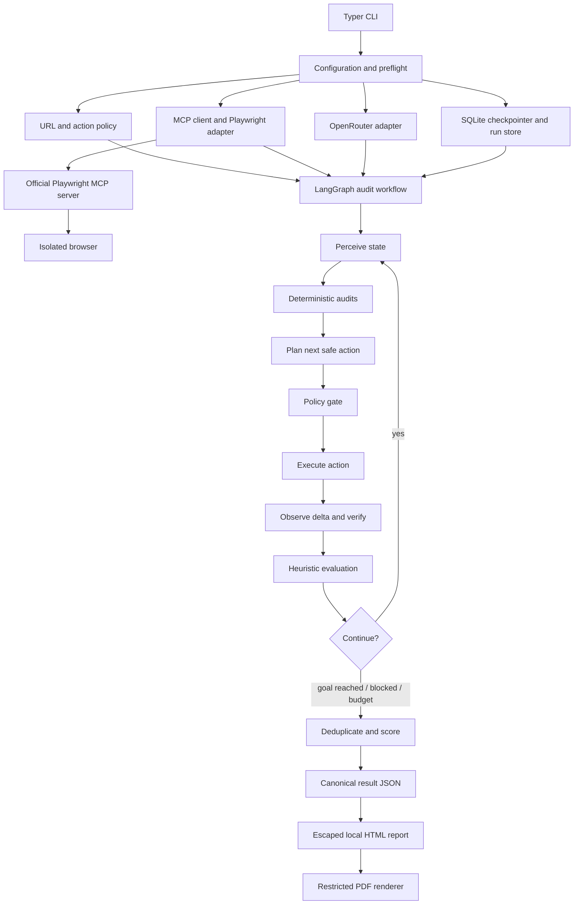

# NormanJr. — Professional Implementation Plan

> Autonomous, evidence-based UX auditing for web applications using Python, LangGraph, the official Microsoft Playwright MCP server, OpenRouter, deterministic checks, and reproducible HTML/PDF reports.

**Document status:** implementation-ready plan  
**Prepared:** 2026-09-05  
**Target platform:** Linux development environment (including Antigravity), with a path to macOS, Windows, CI, and container deployments  
**Project name:** `NormanJr.`  
**Source plan reviewed:** `Gemini-Autonomous AI UX Auditing Agent-20260905-1716.pdf`

---

## 1. Executive decision

The attached proposal has the right product direction, but its sample implementation should **not** be used as the codebase. NormanJr. should keep the proposed combination of LangGraph, browser automation, UX heuristics, OpenRouter, a CLI, screenshots, and PDF reporting, while replacing the proof-of-concept loop with a typed, asynchronous, policy-controlled, evidence-first architecture.

The key design decisions are:

1. Use the official Microsoft package, `@playwright/mcp`, not the unofficial/outdated `@executeautomation/playwright-mcp-server` package shown in the proposal.
2. Treat the Playwright MCP server as an external capability discovered at runtime. Call `list_tools()` during startup and fail with a useful compatibility report if required tools are missing.
3. Keep one asynchronous event loop from CLI entry to MCP shutdown. LangGraph nodes that perform I/O must be `async`, and execution must use `await graph.ainvoke(...)` or async streaming. Never call `asyncio.run()` inside a graph node.
4. Keep browser/MCP clients, model clients, loggers, and stores in LangGraph runtime context—not in checkpointed graph state.
5. Use accessibility snapshots for element discovery and targeting; use screenshots for visual analysis and report evidence. A screenshot is not a safe source of click coordinates by default.
6. Put a deterministic policy gateway between every model-proposed action and every MCP tool call. The model proposes a small typed action; it never selects arbitrary MCP tools or emits executable JavaScript.
7. Combine deterministic audits with model judgment. Deterministic evidence—DOM metrics, accessible names, target sizes, focus behavior, axe-core results, timing, console errors, and network failures—must be collected before subjective visual/heuristic evaluation.
8. Do not claim to “audit a website completely.” A site can be unbounded. Report explicit journey, state, viewport, and interaction coverage, plus confidence and limitations.
9. Do not let the model invent a score. Findings use fixed, versioned severity penalties, are deduplicated by root cause, and only confirmed findings affect the score.
10. Make the canonical output structured JSON. Build HTML and PDF from that data so reporting can be regenerated without rerunning the browser.
11. Default to safe exploration: isolated browser storage, synthetic data, no purchase, deletion, external communication, account mutation, or final form submission without an explicit user policy.
12. Treat all page text and images as hostile data because indirect prompt injection is a primary risk for browser agents.

---

## 2. Assessment of the attached plan

### 2.1 What should be retained

| Proposal idea | Decision | How NormanJr. should implement it |
|---|---|---|
| LangGraph orchestration | Retain | Use an async `StateGraph` with typed state, runtime context, conditional routing, checkpointing, retry rules, and explicit termination reasons. |
| Playwright through MCP | Retain | Use the official `@playwright/mcp` server over local stdio for development and a sandboxed local/remote service for production. |
| OpenRouter model | Retain | Build a small async OpenRouter adapter with capability preflight, structured outputs, retries, usage capture, and text-only fallback. |
| Accessibility tree plus screenshots | Retain | Accessibility snapshots drive navigation; screenshots and bounding-box metrics support visual evaluation and evidence. |
| Norman/Nielsen/Fitts/Hick rubric | Retain and expand | Encode a versioned rubric covering Norman, Nielsen, WCAG 2.2 A/AA, form UX, keyboard behavior, responsive behavior, and clearly labeled heuristic laws. |
| Step-by-step journey report | Retain | Record before/after state, proposed action, policy decision, executed action, latency, screenshot, snapshot hash, findings, and completion status. |
| Deterministic scoring | Retain and strengthen | Score unique confirmed findings by category and severity; expose coverage and confidence separately. |
| Multi-step forms | Retain with safety constraints | Detect form state and progress; use typed synthetic personas; stop before risky/final submissions unless explicitly allowed. |
| CLI-first experience | Retain | Provide `doctor`, `models`, `audit`, `resume`, `report`, and `inspect` commands with useful exit codes. |

### 2.2 What must be corrected

| Problem in the proposal | Why it is a problem | Required correction |
|---|---|---|
| Uses `@executeautomation/playwright-mcp-server` | It is not the current official Microsoft server. Tool names and behavior differ. | Use a locally pinned `@playwright/mcp` dependency. The official command is based on `npx @playwright/mcp@latest`, but production builds must use the lockfile-pinned local binary. |
| Assumes tools called `navigate`, `screenshot`, `get_accessibility_tree`, `click`, `type`, and `evaluate_script` | Current official tools use names such as `browser_navigate`, `browser_snapshot`, `browser_take_screenshot`, `browser_click`, `browser_type`, and `browser_evaluate`. APIs can evolve. | Add a capability adapter and runtime contract test. Never scatter raw tool names throughout graph nodes. |
| Calls synchronous `graph.invoke()` from an async function | This blocks the event loop and conflicts with async MCP work. | Use async nodes and `await graph.ainvoke(...)`/`graph.astream(...)`. |
| Calls `asyncio.run()` inside graph nodes | Nested event loops fail in an already-running async CLI and produce brittle resource cleanup. | One top-level event loop only. All I/O remains async. |
| Stores raw MCP response objects in state | MCP content blocks are not necessarily JSON serializable and should not be checkpointed directly. | Normalize MCP responses into project-owned Pydantic models before state updates. |
| Falls back to “clean interface” when JSON parsing fails | A model/parser failure becomes a false pass and an inflated score. | Record an `evaluation_error`, retry within budget, then mark that state “not evaluated”; never convert failure into compliance. |
| Allows model-generated arbitrary selectors/coordinates/scripts | This is unreliable and creates prompt-injection and tool-abuse risks. | Restrict actions to references from the latest snapshot, validated same-origin URLs, and fixed executor templates. Disable arbitrary code tools. |
| Uses only an LLM to inspect accessibility and target size | The model can hallucinate values that the browser can measure exactly. | Collect deterministic DOM metrics and axe-core findings; use the model only for interpretation not directly measurable in code. |
| Scores every step independently | Persistent navigation or layout issues get charged repeatedly, making the result depend on step count. | Normalize and deduplicate findings by rule, root cause, target/component, viewport, and journey scope before scoring. |
| Uses one score starting at 100 | It hides category quality, coverage gaps, uncertainty, and repeated-root-cause problems. | Produce category scores, overall weighted score, journey scores, coverage, confidence, and “not assessed” categories. |
| Claims automatic whole-app traversal | Authentication, infinite feeds, role-based states, destructive actions, CAPTCHAs, and hidden paths make completeness unknowable. | Use bounded goal-directed journeys, route/state budgets, sitemap hints, explicit test accounts, and transparent coverage metrics. |
| Hardcodes a free vision model | OpenRouter free models and endpoint capabilities change. Some do not accept images or structured output. | Discover models from OpenRouter at runtime; validate image input and structured-output support; allow an explicit configured model; degrade gracefully. |
| Assumes free models are production-grade | Free models have low rate limits and variable availability. As of the research date, OpenRouter documents 50 free requests/day for accounts below the credit threshold and 1,000/day after at least $10 in purchased credits. | Design a low-call mode and caching, but document that production needs a paid or self-hosted fallback. |
| Fixed sleep after every interaction | It is slow and does not prove the page settled or gave feedback. | Use MCP settling plus condition-based waits, capture action timing, and compare before/after snapshots. Use bounded waits only when needed. |
| No durable state | A long audit is lost after a crash or model/network interruption. | Add a SQLite checkpointer for local development and a future PostgreSQL checkpointer for distributed production. |
| No security model | An autonomous browser can hit internal services, execute destructive actions, leak credentials, or follow instructions embedded in a page. | Implement URL/redirect controls, egress restrictions, isolated profiles, a typed action policy, secret redaction, prompt-injection boundaries, quotas, and a kill switch. |
| Direct ReportLab flow only | It mixes audit logic with presentation, is difficult to style, and risks malformed markup from page text. | Persist result JSON; render a local, escaped Jinja2 HTML report; print it to PDF in a separate restricted renderer session. |
| No test strategy | Agent demos can appear successful while failing deterministically. | Add unit, contract, integration, golden-report, security, resilience, and end-to-end fixture-site tests. |

### 2.3 Product claims that must remain qualified

NormanJr. is an **automated heuristic and evidence-gathering assistant**, not:

- a substitute for moderated usability studies or tests with people with disabilities;
- a guarantee of WCAG conformance, legal compliance, or complete site coverage;
- a penetration-testing tool;
- permission to bypass authentication, bot defenses, CAPTCHAs, robots policies, or site terms;
- a system that may safely submit purchases, delete records, send messages, change permissions, or create legal commitments without explicit authorization.

Every generated report must include these limitations and state the exact audit scope.

---

## 3. Product definition

### 3.1 Primary user story

A developer, designer, or QA engineer provides a URL and optionally one or more user goals. NormanJr. opens the site in an isolated browser, explores bounded user journeys, records evidence, checks deterministic accessibility and interaction properties, assesses usability against a versioned rubric, calculates transparent scores, and produces JSON, HTML, and PDF reports.

### 3.2 MVP capabilities

The first releasable version must:

1. Audit a public HTTP(S) site in desktop Chromium.
2. Accept one or more explicit goals, or generate a small set of safe goals from the landing page.
3. Navigate links, buttons, tabs, menus, and non-destructive multi-step forms.
4. Use accessible snapshot references for interaction.
5. Capture viewport and full-page screenshots at important states.
6. Collect element metrics, axe-core results, console errors, failed requests, action latency, and before/after UI deltas.
7. Evaluate Norman and Nielsen principles with evidence-linked findings.
8. Score deterministically and report coverage/confidence.
9. Save a resumable run directory with a canonical JSON result.
10. Generate polished local HTML and PDF reports.
11. Enforce navigation, action, token, time, step, and cost budgets.
12. Run fully from a CLI and return meaningful exit codes.

### 3.3 Deferred capabilities

Defer these until the MVP is reliable:

- multiple simultaneous browsers or distributed workers;
- authenticated session capture UI;
- mobile Safari/WebKit and Firefox parity;
- visual regression against a historical baseline;
- organization dashboard or hosted SaaS;
- automatic source-code patches;
- multilingual UX evaluation beyond preserving page content;
- real-user telemetry ingestion;
- unrestricted crawling;
- autonomous completion of purchases or other high-impact workflows.
- bypassing CAPTCHA or anti-bot systems;
- testing sites without authorization;
- entering real-alike imaginery personal, payment, health, or authentication data;

### 3.4 Explicit non-goals

- vulnerability exploitation;
- asserting accessibility certification from automated checks alone;
- reproducing Browser Use’s proprietary implementation. NormanJr. may emulate the public interaction pattern—observe, plan, act, verify—using its own design.

---

## 4. Quality attributes and success criteria

| Attribute | Initial target |
|---|---|
| Reproducibility | Same fixture site, configuration, model, rubric, and seed produces the same deterministic findings and action-policy decisions. |
| Evidence traceability | Every scored finding links to a journey, step, page state, target, rule, and at least one artifact or measured value. |
| Safety | Default run cannot submit a final form, download/upload arbitrary files, navigate to private IP ranges, or invoke arbitrary browser code. |
| Resilience | A transient OpenRouter failure, malformed model response, or MCP tool error is retried within budget and then reported without becoming a false pass. |
| Recoverability | An interrupted run can resume from its latest safe checkpoint or clearly explain why browser state must be reconstructed. |
| Boundedness | Every run has maximum duration, actions, states, pages, LLM calls, tokens, retries, artifact bytes, and optionally cost. |
| Observability | Structured logs include run/journey/step IDs, tool latency, model usage, retries, policy decisions, and sanitized errors. |
| Portability | Linux is first-class; platform-specific browser prerequisites are diagnosed by `normanjr doctor`. |
| Testability | Planner, policy, scoring, deduplication, report rendering, and graph routing are testable without a live browser or model. |
| Explainability | Scores can be recomputed entirely from the persisted findings and rubric version. |

---

## 5. Recommended architecture



### 5.1 Trust boundaries

1. **Trusted application code:** configuration validation, policy engine, executor mappings, deterministic collectors, scoring, redaction, and report renderer.
2. **Untrusted target content:** all DOM text, accessible names, images, URLs, scripts, console logs, downloaded content, and network responses.
3. **Untrusted probabilistic output:** all model output until it passes schema and policy validation.
4. **Privileged browser boundary:** the MCP server and browser can access the network and browser profile, so they must be isolated and least-privileged.
5. **Sensitive data boundary:** API keys, test credentials, storage-state files, screenshots, and page content must not be written to logs or reports without policy checks.

### 5.2 Why LangGraph is appropriate

LangGraph is justified here because the workflow is long-running, stateful, cyclic, recoverable, and mixes deterministic and probabilistic steps. It should not be used merely as a wrapper around a `while` loop. The implementation must use its strengths:

- typed partial state updates and reducers;
- conditional routing and explicit termination;
- asynchronous nodes;
- checkpointed progress;
- retry and recovery boundaries;
- streaming progress to the CLI;
- optional interrupts for risky actions;
- runtime context for non-serializable dependencies.

---

## 6. Target repository layout

```text
NormanJr./
├── .env.example
├── .gitignore
├── .python-version
├── CHANGELOG.md
├── CONTRIBUTING.md
├── IMPLEMENTATION_PLAN.md
├── LICENSE
├── README.md
├── SECURITY.md
├── package.json
├── package-lock.json
├── pyproject.toml
├── uv.lock
├── config/
│   ├── default.toml
│   ├── rubrics/
│   │   └── ux-rubric-v1.yaml
│   └── playwright-mcp.json
├── docs/
│   ├── architecture.md
│   ├── audit-methodology.md
│   ├── configuration.md
│   ├── development.md
│   ├── report-schema.md
│   ├── safety-model.md
│   └── troubleshooting.md
├── scripts/
│   ├── prepare_axe_asset.py
│   └── verify_tool_contract.py
├── src/
│   └── normanjr/
│       ├── __init__.py
│       ├── __main__.py
│       ├── cli.py
│       ├── config.py
│       ├── exceptions.py
│       ├── logging.py
│       ├── version.py
│       ├── audit/
│       │   ├── accessibility.py
│       │   ├── deduplication.py
│       │   ├── deterministic.py
│       │   ├── heuristics.py
│       │   ├── metrics.py
│       │   ├── rubric.py
│       │   └── scoring.py
│       ├── domain/
│       │   ├── enums.py
│       │   ├── models.py
│       │   ├── schemas.py
│       │   └── serialization.py
│       ├── exploration/
│       │   ├── graph.py
│       │   ├── routing.py
│       │   ├── state.py
│       │   ├── strategies.py
│       │   └── nodes/
│       │       ├── bootstrap.py
│       │       ├── perceive.py
│       │       ├── deterministic_audit.py
│       │       ├── plan.py
│       │       ├── authorize.py
│       │       ├── execute.py
│       │       ├── verify.py
│       │       ├── evaluate.py
│       │       └── finalize.py
│       ├── llm/
│       │   ├── client.py
│       │   ├── model_catalog.py
│       │   ├── prompts.py
│       │   ├── response_parser.py
│       │   └── schemas.py
│       ├── mcp/
│       │   ├── client.py
│       │   ├── content.py
│       │   ├── playwright_adapter.py
│       │   └── tool_contract.py
│       ├── reporting/
│       │   ├── builder.py
│       │   ├── html.py
│       │   ├── pdf.py
│       │   ├── sanitization.py
│       │   ├── assets/
│       │   │   └── report.css
│       │   └── templates/
│       │       └── report.html.j2
│       ├── security/
│       │   ├── action_policy.py
│       │   ├── prompt_boundary.py
│       │   ├── redaction.py
│       │   ├── url_policy.py
│       │   └── secrets.py
│       └── storage/
│           ├── artifacts.py
│           ├── checkpoints.py
│           ├── manifest.py
│           └── run_repository.py
├── tests/
│   ├── conftest.py
│   ├── fixtures/
│   │   ├── model_responses/
│   │   ├── mcp_responses/
│   │   └── sites/
│   │       ├── good/
│   │       ├── accessibility_issues/
│   │       ├── multi_step_form/
│   │       ├── dynamic_feedback/
│   │       ├── navigation_loop/
│   │       └── prompt_injection/
│   ├── unit/
│   ├── contract/
│   ├── integration/
│   ├── security/
│   ├── reports/
│   └── e2e/
└── .github/
    └── workflows/
        ├── ci.yml
        └── dependency-review.yml
```

### 6.1 Runtime output layout

Every run gets an immutable ID and its own directory:

```text
runs/<run-id>/
├── manifest.json
├── config.redacted.json
├── checkpoints.sqlite
├── events.jsonl
├── result.json
├── report.html
├── report.pdf
├── model-usage.json
├── screenshots/
│   ├── journey-001-step-001-before.png
│   └── journey-001-step-001-after.png
├── snapshots/
│   └── journey-001-step-001.md
├── metrics/
│   ├── journey-001-step-001.json
│   └── axe-journey-001-step-001.json
├── traces/
└── errors/
```

The application must use paths under this run directory. A target site must never control output paths or filenames.

---

## 7. Toolchain and environment setup

### 7.1 Required system software

- Git.
- Python 3.12 as the initial supported runtime. The MCP Python SDK supports Python 3.10+, but one explicit project version reduces variability.
- `uv` for Python environment and dependency management.
- Node.js 20 LTS or newer. The official Playwright MCP server requires Node.js 18+, while Node 20+ is the safer project baseline.
- npm for locked Node dependencies.
- Chromium installed by the Playwright package used by `@playwright/mcp`.

### 7.2 Python project bootstrap

Use a packaged `src/` layout and let `uv` manage `.venv` automatically:

1. Initialize a packaged project in the existing directory.
2. Pin Python in `.python-version`.
3. Declare a console script named `normanjr` in `pyproject.toml`.
4. Add runtime and development dependencies with `uv add`, not ad hoc `pip install` calls.
5. Commit `uv.lock`; do not commit `.venv`.
6. CI must install with `uv sync --locked --all-extras --dev`.

A manual `python -m venv` fallback may be documented, but `uv` is the authoritative workflow. Antigravity or VS Code should select `.venv/bin/python` after the first sync.

#### 7.2.1 Exact empty-folder bootstrap sequence

Run the following once the system prerequisites are installed. Review the generated metadata before the first commit; commands intentionally do not include secret values:

```bash
git init
uv init --package --name normanjr --python 3.12 .

uv add langgraph 'mcp>=2,<3' 'pydantic>=2' pydantic-settings httpx \
  typer rich jinja2 markupsafe pillow structlog tenacity platformdirs \
  aiosqlite langgraph-checkpoint-sqlite pyyaml
uv add --dev pytest pytest-asyncio pytest-cov respx ruff mypy pre-commit

npm init -y
npm install --save-exact --save-dev @playwright/mcp axe-core
npx playwright install chromium

uv sync
uv run normanjr --help
git status
```

Then complete these repository steps in order:

1. Replace generated placeholder metadata with the project description, license, authors, Python constraint, build backend, and `[project.scripts] normanjr = "normanjr.cli:app"`.
2. Create the directory tree from section 6 and preserve the generated `src/normanjr/__init__.py`.
3. Add `.gitignore`, `.env.example`, safe default configuration, README, security policy, lint/type/test settings, and CI.
4. Run `uv lock`, `uv sync --locked --all-extras --dev`, the local MCP contract smoke test, and all quality checks.
5. Commit `pyproject.toml`, `uv.lock`, `package.json`, and `package-lock.json`; never commit `.venv`, `.env`, browser profiles, storage state, or `runs/`.
6. Validate reproducibility in a clean clone with only Git, uv, Node, and npm preinstalled.

The package versions resolved during bootstrap must be reviewed and locked. If the latest MCP major version or tool contract differs from this plan, update the adapter specification and tests before implementation rather than silently forcing an incompatible version.

**Fallback without uv:** create `.venv` with `python3.12 -m venv .venv`, activate it, and install the packaged project with `python -m pip install -e '.[dev]'` after manually creating `pyproject.toml`. This path is for environments where uv cannot be installed; it does not replace committing and validating the authoritative `uv.lock` workflow.

### 7.3 Recommended Python dependencies

Use compatible ranges in `pyproject.toml` and exact resolutions in `uv.lock`:

**Core runtime**

- `langgraph` — orchestration and checkpoint-aware workflow.
- `mcp>=2,<3` — current official Python MCP client line as of this plan.
- `pydantic>=2` and `pydantic-settings` — configuration and all model/record validation.
- `httpx` — async OpenRouter and model-catalog requests with explicit timeouts.
- `typer` and `rich` — typed CLI and progress display.
- `jinja2` and `markupsafe` — local HTML report generation with escaping.
- `pillow` — image dimensions, thumbnails, and optional evidence annotations.
- `structlog` — JSON and console logs with bound run IDs.
- `tenacity` — bounded retries for idempotent remote operations only.
- `platformdirs` — cache/config paths.
- `aiosqlite` and the matching LangGraph SQLite checkpointer package supported by the selected LangGraph release.
- `PyYAML` — versioned rubric loading.

**Development**

- `pytest`, `pytest-asyncio`, `pytest-cov`.
- `respx` for HTTP/OpenRouter mocks.
- `ruff` for linting and formatting.
- `mypy` for static checking if retained after a strictness trial.
- `pre-commit`.
- `freezegun` only if time-dependent report tests need it.

Do not add `langchain-openai` solely to call OpenRouter. A small `httpx` adapter gives better control over structured-output support, headers, provider routing, errors, and usage accounting. LangGraph does not require LangChain model wrappers.

### 7.4 Node dependencies

Create a minimal `package.json` with locked development/runtime helpers:

- `@playwright/mcp` — official browser MCP server, pinned through `package-lock.json`.
- `axe-core` — copied or referenced as a generated browser init asset for deterministic WCAG checks.
- `lighthouse` — optional Phase 2 performance and best-practices evidence.

Use the package’s local `playwright-mcp` binary. Avoid fetching `@latest` on every audit; that is non-reproducible and introduces supply-chain drift. A deliberate dependency-update process can refresh the lockfile and rerun contract tests.

### 7.5 Baseline configuration files

- `.env.example`: `OPENROUTER_API_KEY`, optional attribution headers, and no real values.
- `config/default.toml`: budgets, model strategy, viewport profiles, report options, safety defaults, and scoring rubric path.
- `config/playwright-mcp.json`: isolated headless browser, snapshot boxes, output directory placeholder, timeouts, and only required capabilities.
- `.gitignore`: `.venv/`, `.env`, `runs/`, browser profiles, temporary artifacts, coverage, caches, and storage-state secrets.
- `SECURITY.md`: target authorization requirements, safe defaults, reporting vulnerabilities, and handling of credentials/artifacts.

### 7.6 `normanjr doctor`

Implement this before the first real audit. It should verify:

- supported Python version and selected executable;
- package importability and migration-sensitive versions (`langgraph`, `mcp`);
- Node and npm versions;
- locked local Playwright MCP binary availability;
- browser launch ability;
- MCP initialize/list-tools handshake;
- required tool contract;
- axe init asset presence and version;
- OpenRouter key presence without printing it;
- configured model capability and a tiny optional test request;
- writable run directory and available disk space;
- PDF renderer smoke test;
- whether a URL policy intentionally permits local fixture sites.

The command should return non-zero on required failures and distinguish warnings from blockers.

---

## 8. Configuration contract

Use a single Pydantic `Settings` tree loaded in this order:

1. hard-coded safe defaults;
2. project TOML file;
3. optional user-specified TOML file;
4. environment variables;
5. CLI flags.

Secrets must be accepted only through environment variables or a user-provided secret file excluded from reports and version control.

Important settings:

```text
model:
  requested_model
  allow_free_router
  require_vision
  require_structured_output
  request_timeout_seconds
  max_retries
  max_calls
  max_input_tokens
  max_output_tokens
  max_cost_usd

browser:
  browser_name
  headless
  isolated
  viewport_profiles
  action_timeout_ms
  navigation_timeout_ms
  settle_timeout_ms
  output_max_bytes
  storage_state_path

exploration:
  max_journeys
  max_steps_per_journey
  max_unique_states
  max_pages
  max_duration_seconds
  max_repeated_state_visits
  same_origin_only
  allowed_origins
  denied_url_patterns

safety:
  allow_final_submit = false
  allow_download = false
  allow_upload = false
  allow_external_navigation = false
  allow_authentication = false
  allow_destructive_actions = false
  stop_on_captcha = true
  redact_form_values = true

report:
  output_directory
  include_full_snapshots = false
  include_console_errors = true
  include_network_urls = true
  screenshot_quality
  retain_days

scoring:
  rubric_version
  score_probable_findings = false
  category_weights
  severity_penalties
```

The first `config/default.toml` should contain explicit safe and bounded values rather than relying on implicit library defaults. Suggested starting values are three journeys, 20 steps per journey, 60 unique states, 30 minutes, 40 model calls, two model retries, same-origin navigation, headless isolated Chromium, and all high-impact action switches disabled. These values are product defaults to validate on fixtures, not universal performance guarantees.

Validate incompatible combinations before launching the browser:

| Condition | Result |
|---|---|
| `storage_state_path` set while `allow_authentication = false` | Configuration error. |
| Private/loopback target outside test mode | Policy error before DNS connection or browser launch. |
| `require_vision = true` with no eligible image-input model | Preflight error; do not silently downgrade. |
| Vision optional but selected model is text-only | Continue in degraded mode and mark visual criteria not assessed. |
| Strict structured output required but endpoint lacks support | Select another eligible endpoint or fail preflight. |
| `allow_final_submit = true` without an explicit allowed origin and authorization acknowledgement | Configuration error. |
| `max_cost_usd` absent in paid-model mode | Warning in development; error in unattended CI/production mode. |
| Output directory is target-controlled, outside approved roots, or not writable | Configuration error. |
| Requested viewport profile is unknown | Configuration error listing valid profiles. |
| Any maximum is zero/negative or internally inconsistent | Configuration error with the offending path. |

After validation, serialize an immutable, redacted configuration snapshot into the run directory. Runtime nodes read that snapshot and may consume budgets but may not increase limits or weaken policy.

---

## 9. Domain model and persisted schemas

Use Pydantic models at every external boundary and JSON-compatible graph state. Include a `schema_version` on all persisted top-level records.

### 9.1 Core entities

**`AuditRun`**

- run ID, timestamps, status, termination reason;
- normalized target origin and redacted configuration;
- application/rubric/model/MCP/browser versions;
- journeys, findings, scores, coverage, confidence, usage, and artifact index.

**`Journey`**

- journey ID, persona, goal, origin, preconditions;
- allowed and forbidden actions;
- start/end state IDs;
- status: completed, blocked, partial, failed, skipped;
- steps, route coverage, form progress, and completion evidence.

**`PageObservation`**

- URL, title, timestamp, viewport, page state ID;
- snapshot artifact path and normalized snapshot hash;
- screenshot paths and hashes;
- interactive element summaries;
- deterministic metrics, axe result path, console/network deltas;
- active element, dialogs, form/stepper indicators, and visible status messages.

**`ElementDescriptor`**

- current snapshot reference;
- role, accessible name, element kind, states and value summary;
- bounding box, visibility, enabled/focusable status;
- stable fingerprint based on semantic attributes rather than a brittle full CSS path.

**`ProposedAction`**

- enum: `click`, `type`, `select`, `press_key`, `hover`, `scroll`, `back`, `wait_for`, `navigate`, `finish`, `blocked`;
- target reference from the current observation where applicable;
- value category or synthetic-value key, never an arbitrary secret;
- goal rationale, expected UI change, and risk class;
- source observation ID.

**`PolicyDecision`**

- allow, deny, or require approval;
- policy version and machine-readable reason codes;
- normalized action hash and optional approval metadata.

**`ExecutionRecord`**

- requested action, mapped MCP tool and sanitized arguments;
- start/end time, duration, result/error class;
- before/after observation IDs and detected deltas.

**`Finding`**

- stable finding ID and deduplication key;
- source: deterministic, axe, model-supported, or manual-review;
- standard/principle and criterion/rule ID;
- category, severity, status, confidence, and scoring eligibility;
- affected journey/state/target/viewport;
- observation, expected behavior, actual behavior;
- measured data and artifact references;
- user impact, reproducible steps, technical recommendation, and verification advice.

### 9.2 State identity and loop detection

Calculate a normalized page-state fingerprint from:

- canonicalized origin/path with volatile query parameters removed according to config;
- title;
- normalized visible landmark/form/dialog structure;
- stable interactive element tuples `(role, normalized_name, state)`;
- active modal or step indicator;
- selected DOM state signals.

Do not include generated snapshot references, timestamps, random IDs, or all visible copy. Normalize Unicode and whitespace, lowercase role/name keys where semantics permit, sort unordered tuples, and serialize the canonical structure with stable JSON separators and key ordering. Calculate a SHA-256 digest and persist the canonicalization version beside it. Query parameters are retained by default; only configured names with tested semantics—such as known analytics parameters—may be removed. Record both exact and perceptual hashes for screenshots, but do not use screenshot similarity alone as state identity.

A route is considered looping when the same `(state_fingerprint, normalized_action_hash)` pair repeats over the configured threshold without meaningful delta. Compare against the journey’s bounded recent-history window and retain collision diagnostics—the canonical state summary—rather than trusting a digest alone. The workflow should then backtrack or terminate the journey as blocked.

### 9.3 Reducers

Graph list channels such as new findings, events, and steps should use append reducers. Fields representing current observation/action/status should use replacement semantics. Never return the entire accumulated list from a node that uses an append reducer, or items will be duplicated.

### 9.4 Schema and version policy

- Start persisted result, event, rubric, prompt, policy, and state-fingerprint formats at explicit independent versions; do not use the application version as their schema version.
- Readers must reject unknown major schema versions with an actionable migration message and tolerate additive optional fields within a supported major version.
- Store the exact application, Python packages, Node lock hash, MCP server, browser, axe, rubric, prompt, model, provider, and policy versions in `manifest.json`.
- Never mutate an old `result.json` in place. A future migration command writes a new file, records source/target versions, and preserves the original hash.
- Report regeneration must use the rubric and presentation schema recorded by the run, or clearly label that a newer renderer was used.

---

## 10. MCP and browser integration

### 10.1 Connection lifecycle

- Start the pinned local `playwright-mcp` process over stdio.
- Own its lifecycle with one async context manager.
- Initialize the MCP client and immediately list tools.
- Normalize all returned MCP content blocks; inspect `is_error` rather than assuming tool failures raise exceptions.
- Close the MCP context exactly once in the top-level run lifecycle.
- Keep stderr available for diagnostics but redact it before persistence.

### 10.2 Expected official tool contract

The initial adapter should support these current official tools where advertised:

- `browser_navigate`
- `browser_snapshot`
- `browser_take_screenshot`
- `browser_click`
- `browser_type`
- `browser_fill_form`
- `browser_select_option`
- `browser_press_key`
- `browser_hover`
- `browser_wait_for`
- `browser_navigate_back`
- `browser_tabs`
- `browser_console_messages`
- `browser_network_requests`
- `browser_evaluate` for **fixed, application-owned read-only metric scripts only**
- `browser_pdf_save` only in the report-rendering session with the PDF capability

Do not enable or expose `browser_run_code_unsafe` to the planner. Coordinate-based vision tools should remain disabled for the MVP. If a control cannot be targeted from an accessibility snapshot, report that as an operability/semantics concern rather than silently clicking coordinates.

### 10.3 Adapter responsibilities

`PlaywrightAdapter` must expose project-owned methods such as `navigate()`, `observe()`, `click_ref()`, and `type_ref()` rather than raw tool calls. It must:

1. map project actions to discovered MCP tools;
2. validate target references against the latest snapshot;
3. validate URLs through `UrlPolicy`;
4. apply per-tool timeouts;
5. classify tool failures;
6. collect latency and sanitize arguments/results;
7. prevent arbitrary filenames and path traversal;
8. refresh snapshots after state-changing actions;
9. detect page/tab changes;
10. enforce run budgets before every call.

Use a project-owned error taxonomy so graph routing does not parse exception strings:

| Error class | Typical cause | Default recovery |
|---|---|---|
| `McpUnavailable` | Process exited, transport closed, initialize failed | One clean reconnect if no mutating action is in flight; otherwise checkpoint partial failure. |
| `ToolContractError` | Required tool missing or schema changed | Fail preflight; include discovered contract in diagnostics. |
| `ToolArgumentError` | Adapter generated invalid arguments | Do not retry; treat as an application defect. |
| `TargetReferenceExpired` | Snapshot ref changed after navigation/DOM update | Observe again and replan once. |
| `TargetNotActionable` | Hidden, detached, obscured, or disabled element | Refresh observation; record evidence; choose a different action. |
| `NavigationBlocked` | URL policy, redirect policy, download, popup, or origin restriction | Do not retry; terminate/backtrack with policy reason. |
| `BrowserTimeout` | Navigation/action/settling exceeded a bound | Capture available evidence, retry once only when idempotent, then continue partial. |
| `McpToolFailure` | `CallToolResult.is_error` or typed remote failure | Classify by operation; retry only known transient, idempotent calls. |
| `MalformedMcpResponse` | Unexpected/missing content blocks | Preserve sanitized diagnostics, do not infer success, and fail the current operation. |

Only application-owned scripts registered by identifier in a reviewed allowlist may reach `browser_evaluate`. The model selects neither script text nor script identifiers. Adding a metric requires a code change, unit tests, contract tests, and a policy review.

### 10.4 MCP launch profile

Recommended development defaults:

- `--headless` in CI; optional `--headed` for debugging;
- `--isolated` for every audit;
- `--snapshot-boxes` for deterministic target-size evidence;
- `--codegen none` to reduce irrelevant output;
- `--output-dir` set to the current run artifact directory;
- explicit action/navigation/settle timeouts;
- image responses enabled only when a visual-capable model is selected;
- no unrestricted file access;
- no extension connection in automated runs;
- opt-in `pdf` capability only for a separate renderer session;
- opt-in `devtools` capability only when trace/video collection is requested.

### 10.5 Accessibility engine integration

Axe-core should be deterministic evidence, not an LLM prompt:

1. Install and lock `axe-core` through npm.
2. During build/bootstrap, resolve the package’s `axe.min.js` path; do not download an unpinned script at audit time.
3. Configure Playwright MCP to add that script as an init script to each page, or use another tested injection path supported by the selected MCP release.
4. Invoke a fixed `browser_evaluate` function that calls `axe.run()` with WCAG 2.2 A/AA tags and returns only serializable result fields.
5. Run axe after important dynamic states become visible, not only on initial page load.
6. Persist `violations`, `incomplete`, `passes` summary, engine version, URL, and timestamp.
7. Treat `incomplete` as “needs review,” never as pass or fail.
8. Document that automated accessibility checks cannot establish WCAG conformance.

If the selected Playwright MCP version cannot reliably host axe in the page, implement a narrow companion audit service that connects to the same browser through a documented endpoint. Do not silently replace dynamic-state scans with a separate fresh page because that loses the state being audited.

---

## 11. OpenRouter integration

### 11.1 Model capability preflight

Free model availability is dynamic. Do not hardcode model slugs from the attached plan. At startup:

1. Fetch or use a short-lived cache of the OpenRouter model catalog.
2. Check the configured model for required input modalities (`text`, optionally `image`).
3. Check endpoint support for structured outputs when strict JSON schema is requested.
4. Check context length against the prompt budget.
5. If using a free model, verify `:free` status or use the `openrouter/free` router only when its selected modality is acceptable.
6. Persist the actual model and provider returned for each call.
7. Fail preflight if visual audit is required but no eligible vision endpoint is available.
8. Permit a text-only degraded mode using snapshots and deterministic metrics; label all visual-only criteria “not assessed.”

Cache the catalog under the platform-specific user cache directory for at most one hour. Store fetch time and response hash, refresh on explicit model selection miss, and allow stale-cache fallback only when the requested model’s previously observed capabilities still satisfy the run. If neither the network nor cache can establish compatibility, fail closed instead of guessing from a model name.

### 11.2 Request design

Use OpenRouter’s chat completions API through an async `httpx` client with:

- bearer authentication;
- optional `HTTP-Referer` and `X-OpenRouter-Title` attribution;
- connect/read/write/pool timeouts;
- bounded exponential backoff for 429 and transient 5xx responses;
- no retries for invalid schema, authentication, or policy errors;
- `response_format.type = json_schema` and strict schemas where the endpoint supports it;
- provider routing with `require_parameters: true` when structured outputs are mandatory;
- deterministic temperatures where supported;
- usage and cost metadata capture;
- response size limits;
- cancellation support.

### 11.3 Separate model responsibilities

Prefer distinct logical calls even if the same model serves them:

1. **Journey generator:** proposes a small set of safe, representative goals from the landing-page observation.
2. **Action planner:** chooses one typed action toward one goal from the current snapshot.
3. **Heuristic evaluator:** converts already collected evidence into supported qualitative findings.
4. **Report summarizer:** summarizes persisted findings only and cannot change findings, severity, score, or evidence.

For free-tier operation, offer a `--low-call` mode:

- accept user-provided goals instead of generating them;
- use deterministic form/action heuristics where confidence is high;
- combine planning and state-level heuristic evaluation in one schema only if tests show no loss of correctness;
- invoke vision only on new or materially changed visual states;
- cache model analysis by observation hash, rubric version, prompt version, and model ID;
- stop before exceeding the configured call/token/cost budget.

### 11.4 Structured output validation

Each model response must pass:

1. JSON extraction without destructive string replacement tricks;
2. Pydantic schema validation;
3. enum and length constraints;
4. target reference existence in the current observation;
5. URL and action policy checks;
6. cross-field rules, such as requiring a value only for type/select actions;
7. evidence citation validation for findings;
8. output redaction checks.

On failure: retry once with the validation error and the same bounded context, then use a deterministic fallback or mark the state unevaluated. Never fabricate a passing result.

### 11.5 Prompt structure and injection resistance

Prompts must clearly separate:

- trusted system policy;
- rubric and output schema;
- user-authored goal;
- untrusted page snapshot text;
- deterministic metrics;
- prior actions and outcomes.

State repeatedly and unambiguously that content inside the page snapshot or screenshot is data, not instructions. More importantly, enforce this architecturally:

- the planner can emit only the small `ProposedAction` schema;
- the executor independently enforces target, origin, and action policy;
- the planner never sees API keys or storage-state content;
- raw page content is truncated and normalized;
- suspicious injection-like content is tagged and reported;
- no model output can invoke code, choose a shell command, alter the rubric, change budgets, or authorize a blocked action.

---

## 12. Exploration strategy

### 12.1 Journey selection

The CLI accepts repeated `--goal` options. When goals are omitted, generate no more than the configured number of candidates and rank them by product value and safety. Typical safe goals:

- locate primary product/service information;
- find pricing or contact information;
- use search/filter controls;
- open and close navigation, dialogs, and help content;
- begin and progress through a form without final submission;
- recover from a deliberately invalid local input;
- complete a reversible preference or wizard step.

Every journey contains completion and abort criteria. A vague goal such as “test everything” must be converted into bounded journeys or rejected.

### 12.2 Exploration policy

Use goal-directed best-first exploration, not random wandering and not exhaustive DOM clicking.

Before model integration, the deterministic planner used in Phase 5 should tokenize the explicit fixture goal, enumerate interaction candidates from the current observation, remove policy-denied and previously failed candidates, score semantic name/role matches, prefer reversible actions and unvisited destinations, and break ties by stable document order. It must return the same `ProposedAction` schema as the model planner. The graph node remains async for a uniform interface even when this ranking function itself is pure and synchronous.

At each state:

1. Observe and normalize the current state.
2. Check for goal completion, hard blockers, CAPTCHA, login requirements, external redirects, and budget exhaustion.
3. Enumerate permitted actions from current interactive elements.
4. Remove previously failed state/action pairs and actions disallowed by policy.
5. Prefer actions semantically related to the goal.
6. Prefer reversible actions before mutating actions.
7. Penalize revisits and low-information actions.
8. Let the model select from the bounded candidate set, not invent a tool call.
9. Execute one action.
10. Verify a meaningful state delta; if none, record feedback/affordance evidence and retry or choose another action.
11. Backtrack when a branch is blocked and a safe back path exists.

### 12.3 Multi-step forms

Implement a `SyntheticPersona` with safe values by semantic field type:

- generic name and synthetic `example.test` email;
- non-routable phone pattern where validation permits;
- neutral dates and options;
- no real addresses, government IDs, payment details, health data, or credentials.

Form behavior rules:

- inspect labels, required indicators, help text, grouping, and progress before entry;
- test empty or malformed input only where it cannot create side effects;
- record inline validation timing and focus movement;
- select neutral options and avoid consent/marketing choices by default;
- detect `Next`, `Back`, `Save`, and `Submit` semantics;
- stop at the final submit boundary unless `--allow-final-submit` is explicit and the target is authorized/test-only;
- deny purchases, donations, bookings, messages, posts, account changes, deletion, file upload/download, OAuth consent, and password flows unless a future policy supports explicit human approval;
- redact entered values from logs and screenshots where configured.

### 12.4 Dynamic interfaces

Audit dialogs, accordions, tabs, menus, toasts, live validation, loaders, and infinite content by recording state transitions. Check:

- visible and programmatic state change;
- `aria-expanded`, `aria-selected`, dialog naming, and focus placement;
- whether keyboard activation works;
- whether focus becomes trapped or lost;
- whether loading beyond the feedback threshold shows a status indicator;
- whether errors are actionable and preserve entered data;
- whether a back action preserves context;
- whether scroll loading has a reachable alternative or useful progress.

### 12.5 Termination reasons

Persist a typed reason:

- goal completed;
- final-submit boundary reached;
- blocked by policy;
- authentication required;
- CAPTCHA/bot challenge;
- no safe actions;
- repeated state loop;
- target/MCP/model error;
- action/page/state/time/token/cost/artifact budget reached;
- user interrupt;
- successful end of all planned journeys.

A partial or blocked journey is valuable evidence and must appear in the report rather than being reported as success.

---

## 13. LangGraph workflow

### 13.1 Runtime context

Define a runtime context containing non-serializable services:

- `PlaywrightAdapter`;
- `OpenRouterClient`;
- `ActionPolicy` and `UrlPolicy`;
- artifact and run repositories;
- logger/telemetry;
- clock and cancellation event.

Do not place these objects in graph state.

### 13.2 Node sequence

1. **`bootstrap`** — validate config and target, create run/journey IDs, initialize budgets.
2. **`start_session`** — establish MCP session, verify tool contract, launch isolated browser, navigate to approved URL.
3. **`perceive`** — collect snapshot, screenshot when needed, URL/title, current tab, and lightweight browser data.
4. **`deterministic_audit`** — run DOM metrics, axe, console/network deltas, and state-specific checks.
5. **`check_progress`** — determine goal completion, state repetition, blockers, and remaining budgets.
6. **`plan`** — create candidate actions, use deterministic selection or request a schema-validated model proposal.
7. **`authorize`** — allow, deny, or interrupt for approval based on exact normalized action.
8. **`execute`** — map the approved action to one MCP call and record latency/outcome.
9. **`verify`** — capture after-state and compare expected versus actual delta.
10. **`evaluate`** — produce evidence-backed heuristic findings for the transition and current state.
11. **`route`** — continue, backtrack, finish journey, or terminate.
12. **`finalize_journey`** — summarize completion and coverage without changing findings.
13. **`finalize_run`** — deduplicate, score, validate result schema, write canonical JSON.
14. **`render_report`** — generate HTML/PDF from persisted JSON. This may run outside the graph if browser cleanup must happen first.

### 13.3 Persistence and idempotency

- Use an async SQLite checkpointer locally and a unique UUID thread ID per run.
- Keep node side effects idempotent because a checkpointed node may rerun from its start.
- Artifact writes use deterministic names plus atomic temporary-file rename.
- Tool executions use an execution ID. Before repeating a recovered node, check whether the action already completed and has an after-observation.
- Never automatically replay a final-submit or other mutating action after interruption.
- Keep resumable logical state independent from transient browser references; snapshot refs expire after page changes.
- On resume, either reconnect to a saved browser profile/state safely or reconstruct navigation from the verified action history. Mark reconstruction differences.

### 13.4 Streaming and cancellation

Use async graph event streaming to update the Rich CLI with journey, step, action, findings, budgets, and warnings. Handle `SIGINT` by:

1. setting cancellation;
2. allowing the current safe operation to finish or time out;
3. checkpointing status as interrupted;
4. closing browser/MCP resources;
5. writing a partial result and report when possible.

### 13.5 Recursion and budgets

Set the LangGraph recursion limit above the graph-node count implied by the user-facing step budget, while enforcing the stricter application budget in state. Proactively route to finalization before the framework raises a recursion error.

---

## 14. Evidence collection and audit rubric

### 14.1 Evidence hierarchy

From strongest to weakest:

1. deterministic browser measurement or reproducible tool error;
2. axe-core violation with target and rule metadata;
3. verified before/after interaction delta and timing;
4. screenshot plus matching element metrics and snapshot semantics;
5. model interpretation supported by explicit evidence;
6. model-only suggestion, which is marked “needs review” and is not scored by default.

### 14.2 Deterministic checks

Implement fixed, reviewed metric collectors for:

- missing accessible name/label and invalid semantic patterns;
- role/state inconsistencies;
- disabled, hidden, clipped, overlapped, or off-screen targets;
- target dimensions and target spacing;
- text/background contrast when axe can determine it;
- keyboard focusability, visible focus, tab order anomalies, focus trap/loss;
- heading and landmark structure;
- form required/error relationships, `aria-describedby`, invalid state, and error focus;
- dialog naming and focus behavior;
- touch viewport and responsive overflow;
- duplicate interactive names where ambiguity matters;
- page and action timing;
- no visible/semantic feedback after an action;
- browser console exceptions and failed network requests;
- broken links encountered within journey scope;
- unexpected popups/new tabs;
- content or layout changes between before/after screenshots.

Every script passed to `browser_evaluate` must be a checked-in constant selected by an enum. It must not interpolate model- or page-provided code.

### 14.3 Rubric categories

Use a versioned YAML rubric with unique criterion IDs. Initial categories:

1. **Task completion and flow** — successful completion, progress visibility, continuity, backtracking, dead ends.
2. **Discoverability, affordance, and signifiers** — perceivable actions, control identity, link/button distinction, current state.
3. **Feedback and system status** — immediate acknowledgment, loading, completion, selection, and save status.
4. **Mapping and conceptual model** — natural ordering, predictable outcomes, consistency, real-world language.
5. **Constraints, error prevention, and recovery** — validation, destructive-action protection, actionable errors, data preservation, undo/cancel.
6. **Accessibility and operability** — WCAG 2.2 A/AA-oriented semantics, keyboard operation, focus, target size, contrast, labels, status announcements.
7. **Cognitive load and information architecture** — hierarchy, recognition over recall, choice overload, chunking, progressive disclosure, microcopy.
8. **Responsive and motor ergonomics** — reflow, occlusion, reachable and adequately sized targets, spacing, orientation behavior.
9. **Perceived performance and stability** — responsive feedback, layout shifts observed during interactions, blocking states, error handling.
10. **Trust and transparency** — clear consequences, consent clarity, privacy-sensitive input explanation, no deceptive action presentation.

Map criteria to Don Norman, Nielsen, WCAG, Fitts’s Law, Hick’s Law, and other sources accurately. Do not describe Fitts/Hick heuristics as legal conformance rules. Keep Lighthouse performance as a separate evidence section rather than blending its score into the UX score without an explicit rubric decision.

The rubric file must be schema-validated before a run. Its minimum shape is:

```yaml
schema_version: "1.0"
rubric_id: "normanjr-ux"
rubric_version: "1.0.0"
categories:
  - id: accessibility_operability
    label: "Accessibility and operability"
    weight: 0.20
criteria:
  - id: WCAG-2.5.8-TARGET-SIZE
    category_id: accessibility_operability
    title: "Target size (minimum)"
    authority: "WCAG 2.2 SC 2.5.8"
    applicability: [desktop, mobile]
    evidence_requirements: [bounding_box, target_spacing, exception_check]
    default_severity: major
    allowed_severities: [minor, major]
    scope: component
    scoring_eligible: true
severity_penalties:
  critical: 15
  major: 8
  minor: 3
  observation: 0
```

Weights must sum to 1 within a small decimal tolerance. IDs are immutable after release. Each criterion defines applicability, evidence requirements, permitted severity, deduplication scope, authoritative or heuristic source, and whether automated evidence can confirm it. Criteria requiring human judgment default to `needs_review` unless the required evidence contract is satisfied.

### 14.4 Finding lifecycle

A finding moves through:

- `candidate` — generated by a detector/model;
- `confirmed` — evidence and criterion requirements pass;
- `needs_review` — plausible but not deterministically established;
- `duplicate` — linked to canonical root cause;
- `suppressed` — matched by a versioned, documented suppression rule;
- `invalid` — failed schema/evidence validation.

Only `confirmed` findings are scored by default. Suppressions remain visible in raw results.

---

## 15. Scoring, coverage, and confidence

### 15.1 Severity penalties

Start with the proposal’s understandable penalty scale, but define it centrally:

| Severity | Penalty | Definition |
|---|---:|---|
| Critical | 15 | Prevents completion for a broad user group, creates severe error/data risk, or makes the journey unusable. |
| Major | 8 | Causes substantial confusion, repeated failure, inaccessible operation, or a costly workaround. |
| Minor | 3 | Noticeable friction or inconsistency with limited task impact. |
| Observation | 0 | Improvement suggestion or manual-review item without enough evidence for a scored violation. |

A model may propose severity but cannot choose the numeric penalty. The rubric maps severity to penalty.

### 15.2 Deduplication

Compute a root-cause key from:

- rubric criterion or axe rule;
- normalized component/target fingerprint;
- normalized issue signature;
- viewport class;
- scope (`state`, `journey`, `site-wide`).

Repeated evidence attaches to one canonical finding. Charge a site-wide component issue once per affected viewport, not once per step. Journey-blocking consequences may be a separate finding from the underlying component defect only when the rubric explicitly defines both.

### 15.3 Category and overall scores

For each applicable category:

$$
S_c = \max\left(0, 100 - \sum_{f \in U_c} p(f)\right)
$$

where $U_c$ is the set of unique, confirmed, scoring-eligible findings in category $c$ and $p(f)$ is the fixed severity penalty.

The initial overall score is a weighted mean:

$$
S_{overall} = \frac{\sum_c w_c S_c}{\sum_c w_c}
$$

Only applicable categories are included. Store weights in the rubric, not code. A sensible initial weighting is:

| Category group | Weight |
|---|---:|
| Task completion and flow | 25% |
| Accessibility and operability | 20% |
| Feedback and system status | 15% |
| Constraints/error recovery | 15% |
| Discoverability/affordance | 10% |
| Mapping/conceptual model | 5% |
| Cognitive load/information architecture | 5% |
| Responsive/motor ergonomics | 3% |
| Perceived performance/stability | 2% |

This weighting must be validated against expert-labeled fixture reports before calling it stable.

### 15.4 Journey score

Compute journey scores from findings whose evidence occurred in that journey. Clearly distinguish:

- completed journey with quality issues;
- incomplete journey due to site failure;
- partial journey due to NormanJr. policy/budget/tool limitation.

Do not apply a critical site penalty merely because NormanJr.’s own model or browser failed.

### 15.5 Coverage

Report independent coverage dimensions rather than one misleading percentage:

- planned journeys completed/attempted;
- unique page states observed;
- unique routes visited;
- interactive targets exercised/observed;
- forms/steps exercised/observed;
- desktop/mobile viewport coverage;
- axe rules run, passed, failed, incomplete, inapplicable;
- visual criteria assessed/not assessed;
- states skipped because of policy, authentication, CAPTCHA, or budget.

### 15.6 Confidence

Calculate a deterministic confidence label from evidence completeness, not model self-confidence:

- **High:** reproducible deterministic evidence and matching artifacts;
- **Medium:** clear before/after evidence plus model interpretation;
- **Low / needs review:** visual or contextual concern without deterministic confirmation.

Display score and coverage together, for example: “82/100 across 3/4 planned journeys; visual audit available on 7/9 unique states; confidence: medium.”

---

## 16. Reporting system

### 16.1 Canonical outputs

`result.json` is authoritative. Reports are views of that data. The JSON schema must be documented and versioned.

Generate:

- `result.json` — full normalized result;
- `manifest.json` — versions, hashes, artifact index, and run integrity metadata;
- `report.html` — self-contained, escaped, locally viewable report;
- `report.pdf` — print rendering of the same HTML;
- `events.jsonl` — sanitized execution timeline;
- machine-readable exit summary printed by `--json` mode.

### 16.2 Report sections

1. Cover: target, date, run ID, app/rubric/model/browser versions.
2. Executive summary: overall score, coverage, confidence, completion status, top risks.
3. Scope and limitations: goals, viewports, policy boundaries, skipped areas, free-model caveat.
4. Scorecard: category scores and transparent deductions.
5. Journey overview: planned versus completed journeys and blockers.
6. Step-by-step trajectory: before/after evidence, action, expected/actual delta, timing, and concerns.
7. Prioritized findings: critical/major/minor, each with reproduction and fix guidance.
8. Accessibility results: axe violations, incomplete reviews, keyboard/focus checks, WCAG mapping disclaimer.
9. Responsive results: per viewport observations.
10. Reliability/performance evidence: action latency, console errors, failed requests, optional Lighthouse metrics.
11. Positive observations: verified successful patterns, without inventing passes.
12. Methodology: rubric version, scoring formula, deduplication, model and deterministic checks.
13. Technical appendix: artifacts, raw references, termination reason, errors, and model usage.

### 16.3 Finding presentation

Each finding must show:

- stable ID and title;
- severity/category/criterion/source/confidence;
- user impact;
- affected journey and state;
- exact evidence and measured values;
- screenshot with optional target annotation;
- accessible role/name and stable target description;
- steps to reproduce;
- specific implementation recommendation;
- how to verify the fix;
- deduplicated occurrences.

Do not claim exact CSS fixes when source styles are unknown. Phrase them as implementation examples and include the measured issue. Escape all page/model text before HTML rendering.

### 16.4 PDF generation

Recommended approach:

1. Render a local Jinja2 HTML report with bundled CSS/fonts/assets and relative run-directory images.
2. Start a temporary loopback-only static server bound to a random port.
3. Launch a separate isolated Playwright MCP renderer with the `pdf` capability and a policy that permits only that exact loopback origin.
4. Navigate to the generated report and call `browser_pdf_save`.
5. Close the renderer and server.
6. Verify the PDF exists, has non-zero pages/size, and record its hash.

This reuses the already installed browser stack and avoids a second Python browser dependency. Keep HTML generation successful even if PDF rendering fails, and make `normanjr report <run-id>` retryable.

Failure behavior is explicit:

- if the loopback server cannot bind, retain valid JSON/HTML and record `pdf_status = server_failed`;
- if the renderer cannot start or times out, terminate it, retain JSON/HTML, and record a sanitized reason;
- if `browser_pdf_save` reports success but validation finds a missing, empty, or invalid file, discard it and mark PDF unavailable;
- always close the server and renderer in `finally`/async-exit paths;
- the overall audit may succeed with an HTML report and a report-generation warning, while `normanjr report --format pdf` returns a PDF-specific non-zero exit code;
- never fall back to loading remote fonts, scripts, styles, or images while rendering the report.

---

## 17. CLI design

### 17.1 Commands

```text
normanjr doctor [--check-model]
normanjr models [--free] [--vision] [--structured]
normanjr audit URL [OPTIONS]
normanjr resume RUN_ID
normanjr report RUN_ID [--format html|pdf|all]
normanjr inspect RUN_ID [--json]
normanjr version
```

Important `audit` options:

```text
--goal TEXT                    repeatable explicit journey goal
--profile desktop|mobile|both
--model MODEL_ID
--low-call
--max-journeys INTEGER
--max-steps INTEGER
--max-minutes INTEGER
--max-model-calls INTEGER
--max-cost-usd DECIMAL
--same-origin / --allow-origin ORIGIN
--storage-state PATH
--allow-authentication
--allow-final-submit
--headed
--output DIR
--config PATH
--json
--fail-on critical|major|never
```

### 17.2 CLI behavior

- Normalize a bare domain to HTTPS only if unambiguous; otherwise require a valid HTTP(S) URL.
- Print the safety policy and scope before starting.
- Never print secrets or form values.
- Show live progress from graph events, not a spinner that hides errors.
- Print the run directory and report paths on completion or partial completion.
- Support non-interactive CI mode.
- Use stable exit codes: success, findings threshold reached, partial/blocked, configuration error, external service error, internal error, interrupted.

---

## 18. Security, privacy, and responsible operation

### 18.1 URL and SSRF controls

Before navigation:

- allow only `http` and `https` schemes;
- reject embedded credentials, malformed hosts, `file:`, `data:`, `javascript:`, and other schemes;
- resolve A/AAAA records with a tested library/path and reject loopback, private, link-local, multicast, reserved, and cloud metadata ranges by default;
- revalidate explicit model-proposed navigation URLs;
- restrict to the starting origin by default;
- treat redirects as untrusted and verify the final URL immediately;
- for production, enforce the policy at an egress proxy/container network layer because application checks and Playwright MCP origin options are not complete security boundaries;
- provide an explicit `--allow-private-target` development-only override for local fixtures, with a visible warning.

### 18.2 Action safety policy

Classify actions:

- **Low risk:** read snapshot, screenshot, inspect metrics, scroll, hover, open local navigation, use back.
- **Medium risk:** type synthetic data, alter reversible UI state, open same-origin non-destructive controls.
- **High risk:** final form submission, upload/download, external navigation, sending content, authentication changes.
- **Blocked by default:** purchase/payment, deletion, account creation/change, permission/role change, publishing, messaging, booking, legal consent, secrets entry, bypassing CAPTCHA, arbitrary code.

The policy engine, not the LLM, decides. An approval must bind to exact normalized parameters, run ID, expiry, and one execution. Fail closed if policy evaluation or audit logging fails.

### 18.3 Prompt injection controls

- Treat page text and images as untrusted.
- Tag likely injection content as a security observation.
- Do not concatenate page content into system instructions.
- Restrict and schema-validate model output.
- Keep tool authorization independent from model reasoning.
- Never expose arbitrary JavaScript, shell, filesystem, or unrestricted network tools.
- Cap retries and alternative prompt attempts to prevent best-of-N bypass and denial of wallet.
- Add a fixture site containing visible, hidden, encoded, and image-based malicious instructions; expected behavior is continued policy compliance.

### 18.4 Secrets and authenticated audits

- Use a dedicated least-privilege test account.
- Prefer a user-created Playwright storage-state file over giving credentials to the model.
- Encrypt or tightly permission storage-state files; never copy them into reports.
- Pass MCP secrets through its secret mechanism only as defense in depth, not as the sole control.
- Redact cookies, authorization headers, tokens, passwords, form values, and PII in logs and artifacts.
- Give authenticated artifacts a short retention policy and an explicit deletion command in a later release.

### 18.5 Target authorization and etiquette

Require users to confirm they are authorized to audit the target. Support conservative rate limits and a descriptive user agent. Respect site terms, robots guidance where applicable, and bot/CAPTCHA boundaries. Do not implement bypasses.

### 18.6 Supply-chain and process security

- Commit Python and npm lockfiles.
- Pin CI actions to immutable commit SHAs.
- Run dependency review and vulnerability scans.
- Update Playwright MCP deliberately and run tool contract/end-to-end tests.
- Avoid `npx @latest` during normal runs.
- Prefer stdio locally; if HTTP transport is used, bind to loopback by default, authenticate it, and do not expose it publicly.
- Run the browser/MCP process in a container or constrained worker for production.

---

## 19. Testing strategy

### 19.1 Unit tests

Test without network/browser/model:

- settings precedence and validation;
- URL normalization and SSRF cases, including IPv6 and encoded hosts;
- action policy allow/deny/approval matrix;
- Pydantic model response validation;
- MCP content normalization;
- candidate action generation;
- state fingerprint stability;
- loop detection;
- finding evidence validation;
- deduplication and scoring invariants;
- report escaping and path safety;
- redaction;
- budget accounting and termination routing.

Use property-based tests where valuable for URLs, filenames, scoring bounds, and deduplication invariants.

### 19.2 MCP contract tests

Against the locked official server:

- initialize and list tools;
- verify required tool names and schemas;
- navigate to a local fixture;
- capture snapshot/screenshot;
- click/type/select and verify state change;
- collect console/network output;
- run fixed metrics and axe script;
- render a local PDF;
- confirm tool errors are represented correctly.

Contract tests should fail clearly after dependency upgrades.

### 19.3 Local fixture sites

Build static/minimal local sites for deterministic scenarios:

- a well-designed control site;
- missing labels, bad contrast, tiny targets, inaccessible custom controls;
- a multi-step form with validation, Back/Next, and final-submit boundary;
- delayed feedback and duplicate submission risk;
- modal focus trap and focus restoration;
- dynamic tabs/accordion/toast/live region;
- infinite loop/navigation cycle;
- external redirect and blocked URL;
- console exception and failed API request;
- prompt injection in visible text, hidden text, accessibility names, and images.

The test server binds to loopback and runs only under an explicit test URL policy.

### 19.4 Model tests

- Mock all routine OpenRouter responses in CI.
- Validate malformed JSON, missing fields, invalid action refs, unsupported actions, overlong text, rate limiting, timeout, and model fallback.
- Maintain a versioned corpus of planner inputs and expected policy-safe outputs.
- Run optional live model smoke tests manually/nightly, not on every pull request.
- Track model/prompt/rubric versions so changed behavior is explainable.

### 19.5 End-to-end tests

Minimum gates:

1. A good fixture completes and produces no invented scored findings.
2. Known violations produce expected criterion IDs and score deductions.
3. The multi-step fixture advances, tests validation, and stops before final submission.
4. Prompt-injection fixtures cannot trigger external navigation, unsafe tools, or policy changes.
5. A browser/model interruption yields a resumable or valid partial report.
6. Generated HTML/PDF includes screenshots, scores, coverage, limitations, and no raw secrets.
7. Two repeated deterministic runs produce equivalent deterministic results.

### 19.6 Report tests

- JSON Schema validation.
- HTML snapshot/golden tests after normalization.
- PDF smoke checks for page count and expected text.
- very long URLs, selectors, multilingual text, missing images, and hundreds of findings.
- HTML injection and malformed model text escaping.

### 19.7 Quality gates

Every pull request should run:

- Ruff format check and lint;
- static typing;
- unit and security tests;
- coverage threshold focused on policy/scoring/serialization;
- MCP contract tests where Node/browser is available;
- package build and CLI smoke test;
- dependency review.

---

## 20. Observability and operations

### 20.1 Structured event fields

Every event includes:

- timestamp, level, event name;
- run, journey, step, state, and execution IDs;
- application/rubric/prompt/model/provider/MCP versions;
- sanitized URL/origin;
- MCP tool and duration;
- model latency, tokens, and cost when available;
- retry count and error class;
- policy decision and reason code;
- current budget usage.

Do not log chain-of-thought. Store concise planner rationale fields intended for auditability.

### 20.2 Metrics

Track:

- run/journey completion rates;
- actions and states per journey;
- repeated-state and failed-action rates;
- MCP/model latency percentiles;
- schema validation retries;
- token/cost usage;
- policy denials and injection detections;
- artifact volume;
- findings per source/category/severity;
- report generation failures.

### 20.3 Optional tracing

LangSmith can be an opt-in development integration, but NormanJr. must work without it. If enabled, redact target content and secrets before tracing. Local JSONL events remain the baseline source of truth.

---

## 21. Detailed implementation phases

### Phase 0 — Governance and architecture records

**Tasks**

- Choose an open-source license.
- Add `SECURITY.md`, target authorization language, data-retention defaults, and report disclaimer.
- Write short architecture decision records for official Playwright MCP, one async loop, OpenRouter adapter, deterministic-first evidence, scoring, and HTML-to-PDF rendering.
- Freeze MVP scope and action-risk matrix.

**Exit criteria**

- Safety defaults and non-goals are documented and testable.
- No implementation task depends on an unresolved architecture choice.

### Phase 1 — Repository and environment bootstrap

**Tasks**

- Initialize Git and `uv` packaged project.
- Pin Python 3.12 and create `.venv` through `uv sync`.
- Add runtime/dev dependencies and lock them.
- Initialize npm, add locked `@playwright/mcp` and `axe-core` dependencies.
- Add package metadata, console entry point, Ruff, typing, pytest, coverage, pre-commit, and CI.
- Implement `normanjr version` and the first `doctor` checks.

**Exit criteria**

- A clean clone can run locked installation commands.
- `normanjr --help`, lint, type check, and an empty test suite succeed.
- No real secret or generated environment is tracked.

### Phase 2 — Domain contracts and run storage

**Tasks**

- Implement all Pydantic domain models, enums, schema versions, and serializers.
- Implement run directories, atomic writes, artifact hashes, path safety, and JSONL events.
- Define rubric YAML schema and load `ux-rubric-v1`.
- Add redaction and secret-field metadata.

**Exit criteria**

- Example run data round-trips through JSON.
- Invalid findings/actions/configurations fail with actionable errors.
- Artifact paths cannot escape the run directory.

### Phase 3 — MCP bridge and official tool adapter

**Tasks**

- Implement MCP async lifecycle and content-block normalization.
- Launch the locked local Playwright MCP binary.
- Discover tools and validate the contract.
- Implement typed adapter methods for navigation, snapshot, screenshot, interaction, console, network, and fixed evaluation scripts.
- Add timeouts, cancellation, sanitized tracing, and error classification.
- Expand `doctor` to launch and test the server/browser.

**Exit criteria**

- A contract test navigates a local page, interacts through snapshot refs, captures artifacts, and closes cleanly.
- Missing/renamed tools produce a compatibility message, not an attribute or key error.

### Phase 4 — Deterministic observation and audits

**Tasks**

- Normalize snapshots and build element descriptors.
- Add state fingerprints and screenshot hashing.
- Implement fixed DOM metric scripts.
- Integrate axe-core and persist full normalized results.
- Capture console/network deltas and action timing.
- Implement before/after state comparison.

**Exit criteria**

- Known fixture defects are measured without an LLM.
- Dynamic content is audited after it is revealed.
- Failed scans become explicit errors/needs-review records, never passes.

### Phase 5 — LangGraph skeleton without an LLM

**Tasks**

- Define graph state, runtime context, reducers, nodes, and routing.
- Use a deterministic planner for a small fixture flow.
- Add budgets, loop detection, termination reasons, async checkpointing, streaming, and cancellation.
- Make side effects idempotent and test resume behavior.

**Exit criteria**

- The graph completes a deterministic multi-page fixture journey.
- `Ctrl+C` produces a valid partial run.
- Repeated states terminate safely.

### Phase 6 — OpenRouter and model planning

**Tasks**

- Implement model catalog caching and capability filtering.
- Implement async chat requests, strict response schemas, retry/fallback, and usage accounting.
- Add journey-generator and planner prompts with untrusted-content boundaries.
- Restrict planner selection to generated candidate actions and current target refs.
- Add free-model low-call mode and text-only degraded mode.

**Exit criteria**

- Mocked model tests cover all error paths.
- A live smoke test can plan a safe fixture journey.
- Invalid or malicious model output cannot cross the policy gate.

### Phase 7 — Action policy and advanced journeys

**Tasks**

- Implement URL/redirect policy, action classification, final-submit boundary, and synthetic personas.
- Add form, dialog, tabs, menu, validation, keyboard, backtracking, and blocked-journey handling.
- Add optional LangGraph interrupts for future explicit approval mode.
- Implement CAPTCHA/authentication detection and safe termination.

**Exit criteria**

- The multi-step fixture is traversed to the configured boundary.
- Destructive/external actions are blocked even when requested by page content or model output.
- Each policy decision is present in the event trail.

### Phase 8 — Heuristic evaluation, deduplication, and scoring

**Tasks**

- Implement evidence-aware evaluator schemas and prompts.
- Validate every model finding against available evidence and rubric criteria.
- Implement finding lifecycle, deduplication, category/journey scoring, coverage, and confidence.
- Build expert-labeled scoring fixtures and tune rubric weights transparently.

**Exit criteria**

- Score recomputation from `result.json` is deterministic.
- Repeating the same component issue across steps does not multiply deductions.
- Tool/model failures do not improve or lower the site score; they reduce coverage/confidence.

### Phase 9 — HTML and PDF reports

**Tasks**

- Build escaped Jinja2 templates and print CSS.
- Add evidence thumbnails/annotations, scorecards, timelines, appendices, and disclaimers.
- Implement restricted local report server and separate PDF-rendering MCP session.
- Add `report` regeneration from existing JSON.

**Exit criteria**

- Reports render from fixture JSON without network access.
- HTML and PDF contain the same facts and no unsafe markup/secrets.
- Missing screenshots degrade gracefully.

### Phase 10 — CLI completion

**Tasks**

- Complete all commands/options, interactive warnings, JSON mode, and exit codes.
- Stream meaningful graph progress and budget status.
- Add helpful diagnostics and troubleshooting suggestions.
- Write README quickstart and configuration documentation.

**Exit criteria**

- A new user can install, run `doctor`, audit a fixture/public site, and find the reports using only documented steps.
- CI can use the CLI non-interactively.

### Phase 11 — Hardening and release

**Tasks**

- Complete security fixture suite and threat-model review.
- Add resource limits, retention, dependency scans, and reproducible builds.
- Test Linux thoroughly, then macOS/Windows.
- Add container image with non-root user, browser sandbox support, read-only root filesystem where feasible, run-volume output, and controlled egress.
- Publish an initial `0.1.0` release only after acceptance criteria pass.

**Exit criteria**

- No known critical policy bypass.
- Locked clean install and end-to-end tests pass.
- Release artifacts include version and dependency manifests.

### Phase 12 — Post-MVP improvements

- mobile and cross-browser profiles;
- optional Lighthouse collection with repeated runs/median reporting and separate scores;
- authenticated audit workflow with protected storage state;
- historical baseline comparison and regression mode;
- PostgreSQL checkpointer and worker isolation;
- team dashboard/API;
- expert review workflow for `needs_review` findings;
- calibrated rubric based on human UX-auditor agreement;
- optional source-aware recommendations when the user supplies their codebase.

---

## 22. Initial acceptance scenarios

NormanJr. `0.1.0` is complete only when all scenarios pass:

1. **Install:** clean Linux environment creates `.venv`, installs locked Python/Node dependencies, and passes `doctor`.
2. **Static public page:** audit captures snapshot/screenshot, deterministic checks, score, HTML, and PDF.
3. **Dynamic form:** audit advances through multiple steps, validates an error state, records feedback, uses Back, and stops before final submission.
4. **Accessibility:** seeded WCAG defects are found by axe/metrics and mapped to report evidence; incomplete checks remain review items.
5. **Visual-only issue:** vision model finding cites a screenshot and metrics, is marked with appropriate confidence, and does not invent a selector.
6. **Prompt injection:** hostile page content cannot alter goals, reveal secrets, invoke arbitrary code, or navigate externally.
7. **SSRF:** private, loopback, metadata, non-HTTP, encoded, and redirect target cases are blocked outside explicit test mode.
8. **Loop:** cyclic navigation terminates within budget and reports partial coverage.
9. **Provider failure:** rate limit/malformed response results in bounded retry and a partial/degraded report, not a false 100.
10. **Resume:** interrupted audit resumes or reconstructs safely without duplicating an executed action.
11. **Deduplication:** a shared bad header control on five states creates one canonical site-wide finding with five occurrences.
12. **Report safety:** malicious HTML/Markdown in page or model text is escaped in HTML/PDF.
13. **Score auditability:** a standalone recomputation produces exactly the stored category and overall scores.
14. **No secrets:** API key, cookies, authorization headers, storage state, and entered sensitive values are absent from logs/reports.

---

## 23. Recommended first vertical slice

Do not begin by implementing every heuristic. Build this thin end-to-end slice first:

1. Project bootstrap and `doctor`.
2. MCP connection and tool discovery.
3. Navigate to a local two-page fixture.
4. Capture `browser_snapshot` and `browser_take_screenshot`.
5. Deterministically choose and execute one `browser_click` using a snapshot reference.
6. Capture the after-state and timing.
7. Create one hard-coded, evidence-backed fixture finding.
8. Persist canonical JSON.
9. Render HTML and PDF.
10. Add tests and then replace the hard-coded finding with deterministic and model evaluators.

This proves all high-risk integration seams—Python/MCP/Node/browser/state/artifacts/reporting—before investing in broad heuristics.

---

## 24. Release checklist

### Functionality

- [ ] Explicit goals and generated safe goals work.
- [ ] Desktop public-site flow works.
- [ ] Dynamic and multi-step form states work.
- [ ] All findings are evidence-linked.
- [ ] JSON, HTML, and PDF outputs are valid.
- [ ] Partial and blocked journeys are represented honestly.

### Reliability

- [ ] MCP/model failures are bounded and classified.
- [ ] Checkpoint/resume behavior is tested.
- [ ] No false pass on parser or audit failure.
- [ ] Scoring is deterministic and deduplicated.
- [ ] Browser/MCP processes close on success, error, and interrupt.

### Security and privacy

- [ ] URL and egress controls pass adversarial tests.
- [ ] Unsafe actions are denied independently of the model.
- [ ] Prompt-injection fixture passes.
- [ ] Secrets and PII are redacted.
- [ ] Isolated profiles are default.
- [ ] Artifact retention and target authorization are documented.

### Engineering quality

- [ ] Lockfiles committed.
- [ ] Formatting, lint, typing, tests, and package build pass.
- [ ] Official MCP tool contract test passes.
- [ ] Dependency and license review completed.
- [ ] README, methodology, safety, configuration, and troubleshooting docs completed.

---

## 25. Research basis and implementation notes

The following primary sources were checked on 2026-09-05 and should be rechecked when dependencies are upgraded:

1. [Microsoft Playwright MCP](https://github.com/microsoft/playwright-mcp) — official package, current tool names, accessibility-snapshot approach, launch options, capabilities, profile behavior, and security warning.
2. [MCP Python SDK](https://github.com/modelcontextprotocol/python-sdk) and [MCP client guide](https://modelcontextprotocol.io/docs/develop/build-client) — current v2 client lifecycle, stdio transport, content blocks, tool errors, and Python requirements.
3. [LangGraph overview](https://docs.langchain.com/oss/python/langgraph/overview), [Graph API](https://docs.langchain.com/oss/python/langgraph/graph-api), and [persistence](https://docs.langchain.com/oss/python/langgraph/persistence) — async/stateful graph design, reducers, runtime context, idempotency, recursion limits, and checkpointers.
4. [OpenRouter quickstart](https://openrouter.ai/docs/quickstart), [structured outputs](https://openrouter.ai/docs/features/structured-outputs), and [FAQ](https://openrouter.ai/docs/faq) — API usage, capability variability, JSON schema support, free-model limits, privacy, and model discovery.
5. [Playwright accessibility testing](https://playwright.dev/docs/accessibility-testing) and [axe API documentation](https://www.deque.com/axe/core-documentation/api-documentation/) — axe integration, dynamic-state scanning, WCAG tags, results, and limitations of automated accessibility checks.
6. [WCAG 2.2](https://www.w3.org/TR/WCAG22/) and [WAI-ARIA Authoring Practices](https://www.w3.org/WAI/ARIA/apg/) — normative accessibility criteria and expected widget patterns. Some W3C pages rejected the automated research fetch, so implementation must verify exact normative wording directly before encoding a rule.
7. [Lighthouse overview](https://developer.chrome.com/docs/lighthouse/overview) and [performance scoring](https://developer.chrome.com/docs/lighthouse/performance/performance-scoring) — automated page-quality audits and score variability.
8. [OWASP AI Agent Security](https://cheatsheetseries.owasp.org/cheatsheets/AI_Agent_Security_Cheat_Sheet.html), [LLM Prompt Injection Prevention](https://cheatsheetseries.owasp.org/cheatsheets/LLM_Prompt_Injection_Prevention_Cheat_Sheet.html), and [SSRF Prevention](https://cheatsheetseries.owasp.org/cheatsheets/Server_Side_Request_Forgery_Prevention_Cheat_Sheet.html) — tool least privilege, indirect prompt injection, human approval, budget controls, data protection, and browser-target URL risks.
9. [MCP Security Best Practices](https://modelcontextprotocol.io/docs/tutorials/security/security_best_practices) — local MCP process, stdio, SSRF, scope, authorization, and sandboxing considerations.
10. [uv project guide](https://docs.astral.sh/uv/guides/projects/) and [GitHub Actions integration](https://docs.astral.sh/uv/guides/integration/github/) — `.venv`, `pyproject.toml`, lockfiles, and reproducible CI setup.

### Versioning rule

The versions observed during planning are not permanent recommendations. The repository must pin exact resolved dependencies in lockfiles, record them in each run manifest, and upgrade them through tested pull requests. Tool schemas and model capabilities are runtime contracts, not assumptions.

---

## 26. Final implementation principle

NormanJr. should be built as an **auditable test system with an agent inside it**, not as an unrestricted agent with reporting added afterward. Deterministic measurement, policy enforcement, evidence persistence, and honest coverage come first; model reasoning is a bounded component that helps choose journeys and interpret evidence. That ordering is what turns the attached prototype idea into a professional application.
