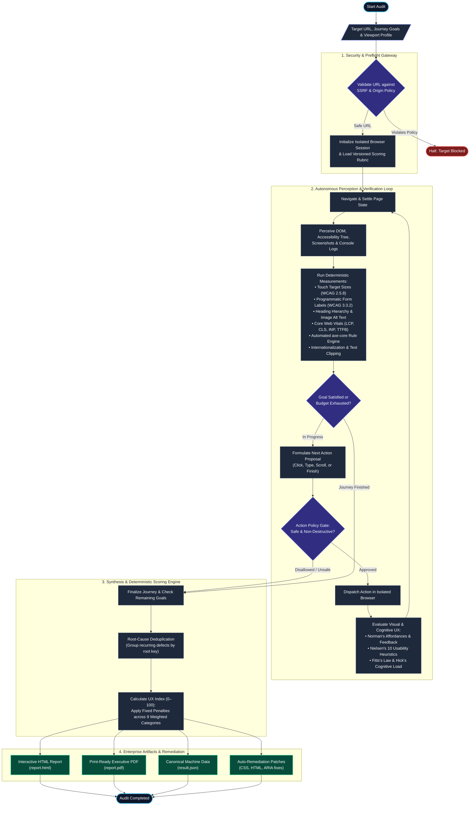

<p align="center">
  
</p>

> **Autonomous, evidence-based UX auditing for web applications.**  
> Bridging the gap between functional code and exceptional usability through empirical measurements, cognitive design heuristics, and autonomous exploration.

<p align="center">
  <a href="https://www.python.org/"></a>
  <a href="https://www.w3.org/WAI/standards-guidelines/wcag/"></a>
  <a href="https://github.com/dequelabs/axe-core"></a>
  <a href="https://web.dev/explore/learn-core-web-vitals"></a>
  <a href="https://openrouter.ai/"></a>
  <a href="LICENSE"></a>
  <a href="docs/assets/sample-report.pdf"></a>
</p>

---

> *"Good design is actually a lot harder to notice than poor design, in part because good designs fit our needs so well that the design is invisible."*  
> — **Don Norman**, *The Design of Everyday Things*

---

## Table of Contents

- [Overview](#overview)
- [The Core Philosophy](#the-core-philosophy)
- [Core Architecture](#core-architecture)
- [Key Capabilities](#key-capabilities)
- [Sample Audit Report](#sample-audit-report)
- [Documentation](#documentation)
- [License and Acknowledgments](#license-and-acknowledgments)

---

## Overview

A web application can have bulletproof backend architecture, flawless databases, and sophisticated business logic, yet still fail completely in the market because it is simply not **usable**. 

When interfaces suffer from confusing navigation hierarchies, unlabelled controls, sluggish interaction latency, poor visual affordances, or accessibility barriers, real users become frustrated and abandon the site. Countless websites that are functionally sound under the hood end up struggling to gain popularity or retain users because the actual human experience of using them was never properly validated.

Historically, bridging this gap required one of two extremes:
1. **Expensive and Slow Manual Audits**: Hiring specialized UX and accessibility consultancies, which often takes weeks of manual review, costs thousands of dollars per audit, and cannot scale to modern continuous deployment cycles.
2. **Superficial Automated Linting**: Relying on basic static checkers that only inspect raw HTML syntax without understanding dynamic user journeys, visual layout shifts, cognitive friction, or how real humans navigate interfaces.

**NormanJr. was created to bridge this exact gap.**

Named in honor of **Don Norman**—cognitive scientist, author of *The Design of Everyday Things*, and pioneer of user-centered design—NormanJr. provides teams with an autonomous, evidence-first auditing system. It explores web applications just like a human user would: navigating journeys, assessing touch and visual ergonomics, verifying accessibility standards (WCAG 2.2 A/AA), measuring real-world Google Core Web Vitals, and applying multimodal AI reasoning against established cognitive heuristics.

The result is a fast, reproducible, and objective audit that delivers transparent scores, detailed visual evidence, and drop-in code fixes without the traditional cost, delay, or human bias of manual agency reviews.

---

## The Core Philosophy

NormanJr. is built on four core principles:

```
┌─────────────────────────────────────────────────────────────────────────────┐
│                           NORMANJR CORE PILLARS                             │
├──────────────────────┬──────────────────────┬───────────────────────────────┤
│ Evidence Over Opinion│ Deterministic checks │ Objective measurements (DOM   │
│                      │ precede AI judgment  │ target sizes, contrast, axe,  │
│                      │                      │ Core Web Vitals) come first.  │
├──────────────────────┼──────────────────────┼───────────────────────────────┤
│ Grounded Heuristics  │ Cognitive psychology │ Evaluates Don Norman's laws,  │
│                      │ & usability canons   │ Nielsen's 10 heuristics,      │
│                      │                      │ Fitts's law, & Hick's law.    │
├──────────────────────┼──────────────────────┼───────────────────────────────┤
│ Zero-Trust Security  │ Untrusted pages &    │ Deterministic ActionPolicy &  │
│                      │ hostile input        │ UrlPolicy gateway prevent     │
│                      │                      │ SSRF, mutations, & injection. │
├──────────────────────┼──────────────────────┼───────────────────────────────┤
│ Explainable Scoring  │ Fixed versioned      │ The AI never invents scores.  │
│                      │ penalty calculus     │ Deduplicated root causes feed │
│                      │                      │ a transparent 0-100 UX Index. │
└──────────────────────┴──────────────────────┴───────────────────────────────┘
```

1. **Evidence First, Judgment Second**: An automated tool should never guess button dimensions, contrast ratios, or load latencies when the browser engine can measure them with precision. NormanJr. captures computed bounding boxes, accessibility trees, timing metrics, and automated rules before applying AI reasoning.
2. **Stateful Journey Exploration**: Real users navigate dynamic, multi-step flows. NormanJr. uses an autonomous state machine to explore user journeys, fill forms with safe synthetic data, handle interactive modals, and test responsive states.
3. **No Hallucinated Scores**: The system never invents an arbitrary rating. Scores are calculated deterministically from an open, versioned rubric where verified issues apply fixed mathematical deductions grouped by root cause.
4. **Zero-Trust Safety & Isolation**: Web content is treated as untrusted data. A deterministic policy gateway intercepts every proposed action, preventing SSRF, external redirections, destructive actions, and unauthorized form submissions.

---

## Core Architecture

The following flowchart illustrates how NormanJr. moves from initial target input through autonomous exploration, deterministic verification, heuristic evaluation, and final reporting:



---

## Key Capabilities

- **Autonomous Multi-Journey Exploration**: Evaluates end-to-end user journeys, wizards, and interactive forms with safe synthetic data while automatically halting before final irreversible submissions.
- **Empirical Accessibility Auditing**: Evaluates WCAG 2.2 A/AA standards including 24×24px touch targets, programmatic form labels, heading hierarchies, keyboard traps, and embedded axe-core checks.
- **Cognitive & Usability Heuristics**: Evaluates interfaces against Don Norman's principles (affordances, signifiers, constraints, feedback), Jakob Nielsen's 10 heuristics, and psychometric UX laws (Fitts's Law, Hick's Law).
- **Real-Time Core Web Vitals**: In-browser extraction of Largest Contentful Paint (LCP), Cumulative Layout Shift (CLS), interaction latency (INP), and mobile abandonment thresholds.
- **Zero-Trust Security**: Hardened SSRF defense blocking loopback and private subnets, strict gates against destructive actions (deletions, checkouts), and defenses against indirect prompt injection.
- **Deterministic UX Index (0–100)**: Transparent scoring across 9 weighted categories with root-cause deduplication to prevent repeated-penalty distortion.
- **Automatic Remediation Patches**: Generates ready-to-apply CSS, HTML, and ARIA fixes for detected accessibility and touch-target violations.
- **Regression Diffing for CI/CD**: Compare baseline vs. pull request audit runs to prevent UX regressions from reaching production.

---

## Sample Audit Report

Want to see what an actual audit output looks like? Explore the real 2-page sample audit report generated directly by NormanJr., featuring executive UX Index scores, Core Web Vitals breakdowns, WCAG 2.2 touch target measurements, and prioritized remediation recommendations:

<p align="center">
  <a href="docs/assets/sample-report.pdf">
    
  </a>
  &nbsp;&nbsp;&nbsp;&nbsp;
  <a href="docs/assets/sample-report.pdf?raw=true">
    
  </a>
</p>

> **Report Highlights**: Includes overall UX Index score, category breakdowns across all 9 usability dimensions, measured Google Core Web Vitals (LCP, CLS, INP), detected accessibility defects with exact DOM selectors, and prioritized engineering recommendations.

---

## Documentation

Comprehensive guides and detailed references are organized in the [`docs/`](docs/) directory:

- **[Quickstart Guide](docs/quickstart.md)**: System prerequisites, installation steps, environment setup, and running your first audit.
- **[CLI Reference](docs/cli-reference.md)**: Complete command-line syntax, flags, and options for all NormanJr. commands (`audit`, `doctor`, `models`, `compare`, `patch`, `login`, `serve`, `report`, `inspect`, `ingest`, `resume`).
- **[Configuration Guide](docs/configuration.md)**: Breakdown of configuration files (`config/default.toml`), environment variables, model selection, exploration budgets, and browser profiles.
- **[UX Rubric & Scoring Guide](docs/rubric-and-scoring.md)**: Deep dive into the 9 UX categories, fixed severity deductions, root-cause deduplication, and confidence calculations.
- **[Key Features Deep-Dive](docs/features.md)**: Complete breakdown of heuristic evaluation, accessibility checks, Core Web Vitals, and team dashboards.
- **[CI/CD Integration Guide](docs/cicd-integration.md)**: Ready-to-use GitHub Actions workflow, quality threshold assertions, and pull request gating.
- **[Safety Boundaries & Qualified Claims](docs/safety-and-claims.md)**: Security architecture, SSRF prevention, action policies, and ethical/legal audit boundaries.
- **[Development & Testing Guide](docs/development.md)**: Running test suites (unit, contract, integration, e2e), code style standards, and adding custom rubric criteria.

---

## License and Acknowledgments

Distributed under the **MIT License**. See [`LICENSE`](LICENSE) for details.

### Acknowledgments

- **Don Norman** — for pioneering user-centered design, cognitive engineering, and the principles of everyday things.
- **Jakob Nielsen** — for establishing the foundational 10 Usability Heuristics.
- **Deque Systems** — for developing the world-class `axe-core` accessibility engine.
- **OpenRouter** — for high-performance multimodal AI model access.

---

<p align="center">
  Built with care for designers, developers, and QA engineers who believe great user experience should be measurable, explainable, and accessible to all.
</p>
